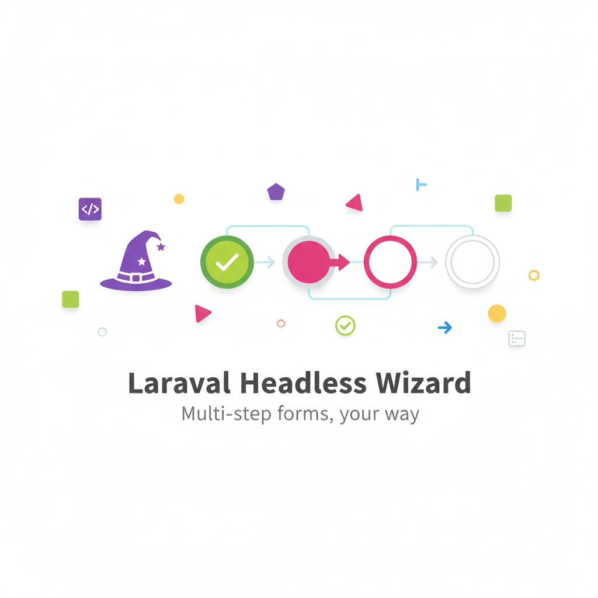

# Laravel Headless Wizard



[](https://packagist.org/packages/invelity/laravel-headless-wizard)
[](https://github.com/invelity/laravel-headless-wizard/actions)
[](https://packagist.org/packages/invelity/laravel-headless-wizard)


A powerful **headless** multi-step wizard package for Laravel. Build complex, multi-page forms with progress tracking, navigation, and validation. **Bring your own frontend** - works with React, Vue, Inertia, Livewire, Alpine.js, or any JavaScript framework.

## ✨ Features

- 🚀 **Zero Frontend Lock-in** - Pure JSON API for any framework
- ⚡ **Interactive Generators** - Beautiful CLI with Laravel Prompts for wizard creation
- 🎨 **Pre-built Components** - Blade components for rapid prototyping (Layout, ProgressBar, Navigation)
- 🔄 **Vue 3 Composable** - useWizard() composable with TypeScript definitions for SPA integration
- 🔀 **Multi-Type Wizards** - Generate Blade, API, Livewire, or Inertia wizards
- ✅ **Laravel-Native Validation** - Uses FormRequest classes with automatic integration
- 💾 **Flexible Storage** - Session, database, or cache adapters
- 📊 **Smart Progress Tracking** - Real-time completion percentages with automatic calculation
- 🔀 **Conditional Logic** - Optional steps, dynamic flows, and step reordering
- 🔔 **Event-Driven** - Hook into every wizard lifecycle event
- ✨ **Modern PHP 8.4** - Property hooks, constructor promotion, and strict types

## 📚 Documentation

**Full documentation available at: [https://invelity.github.io/laravel-headless-wizard/](https://invelity.github.io/laravel-headless-wizard/)**

- [Installation Guide](https://invelity.github.io/laravel-headless-wizard/installation)
- [Configuration](https://invelity.github.io/laravel-headless-wizard/configuration)
- [Creating Wizards](https://invelity.github.io/laravel-headless-wizard/creating-wizards)
- [API Reference](https://invelity.github.io/laravel-headless-wizard/api-reference)
- [Examples](https://invelity.github.io/laravel-headless-wizard/examples)
- [Testing Guide](https://invelity.github.io/laravel-headless-wizard/testing)

## 🚀 Quick Start

Install the package:

```bash
composer require invelity/laravel-headless-wizard
```

Publish the configuration:

```bash
php artisan vendor:publish --tag="wizard-config"
```

Create your first wizard (interactive):

```bash
php artisan wizard:make Onboarding
# Choose wizard type: blade, api, livewire, or inertia
```

Or with options:

```bash
php artisan wizard:make Onboarding --type=blade
```

Add steps to your wizard:

```bash
php artisan wizard:make-step Onboarding PersonalInfo --order=1
# Interactive prompts guide you through step creation
```

## 📋 Requirements

- PHP 8.4 or higher
- Laravel 11.0 or 12.0

## 📊 Code Quality

- **89.7% Test Coverage** - 397 comprehensive Pest tests
- **Cyclomatic Complexity: 4.37** - Clean, maintainable code
- **PHPStan Level 5** - Zero static analysis errors
- **100% Type Coverage** - Full type declarations
- **Architecture Tests** - SOLID principles enforced via Pest Arch

## 🤝 Contributing

Contributions are welcome! Please see [CONTRIBUTING.md](CONTRIBUTING.md) for details.

## 🔒 Security

Report security vulnerabilities via [GitHub Security](../../security/policy).

## 📝 License

The MIT License (MIT). See [LICENSE.md](LICENSE.md) for details.

## 👨‍💻 Credits

- [Martin Halaj](https://github.com/Martin-1182)
- [All Contributors](../../contributors)

---

Built with ❤️ by [Invelity](https://github.com/invelity)
