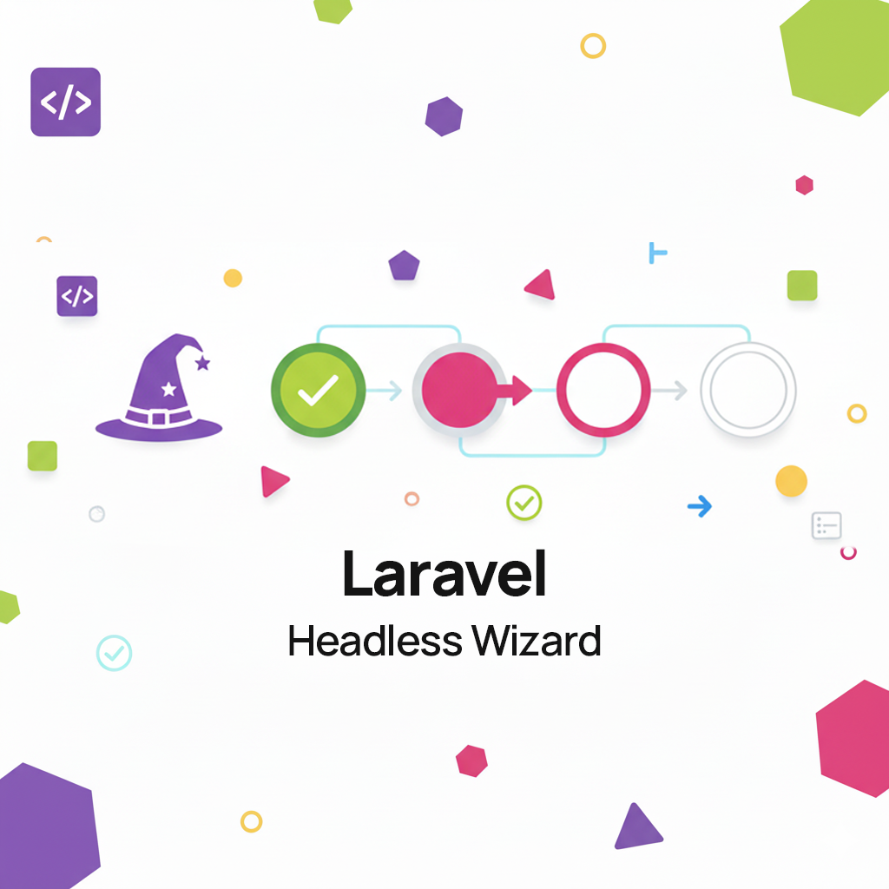

# Laravel Headless Wizard



[](https://packagist.org/packages/invelity/laravel-headless-wizard)
[](https://github.com/invelity/laravel-headless-wizard/actions/workflows/run-tests.yml)
[](phpstan.neon.dist)
[](https://packagist.org/packages/invelity/laravel-headless-wizard)
[](LICENSE.md)

Multi-step wizards for Laravel, built the way Laravel itself is built. You declare a wizard and its steps as classes.
Every step validates its input with a form request. The package keeps each visitor's progress and tells you which step
comes next. The rendering stays yours: Blade, Livewire, Inertia, Vue, React, or a mobile app talking to the JSON API.

```php
use App\Wizards\OrderWizard;

public function store(Request $request, OrderWizard $wizard, string $step)
{
    $wizard->process($step, $request);   // validated by the step's form request

    return to_route('order.step', $wizard->current()->id());
}
```

## Features

- **Typed and stateless.** `OrderWizard $wizard` is injected like a form request and bound to the current visitor.
  There is no `initialize()` and no string ids.
- **Laravel-native validation.** Each step names a form request, and the request runs its whole lifecycle:
  `prepareForValidation()`, `authorize()`, `after()` hooks and `passedValidation()`. Only validated data is stored.
- **Flow rules in one place.** Optional steps, conditional steps (`shouldSkip()`), dependencies that reopen later steps
  when earlier data changes, and display-only steps such as a confirmation page.
- **Scoped stores.** Session, cache, database (encrypted) and array stores. Every visitor's state is kept apart, and
  custom drivers plug in through `Wizard::extend()`.
- **Opt-in JSON API.** `Route::wizard('order', OrderWizard::class)` registers resource-style routes with one response
  shape. The package registers no routes by itself.
- **Generators.** `php artisan wizard:make` and `wizard:make-step` are built on Laravel's `GeneratorCommand`.
  `wizard:make-step --view` also creates the step's Blade view with `make:view`.
- **Events.** `WizardStarted`, `StepCompleted`, `StepSkipped`, `StepReopened`, `WizardCompleted`, `WizardReset`.
- **Translated messages** in English and Slovak.

## Requirements

- PHP 8.4 or higher
- Laravel 12 or 13

## Installation

```bash
composer require invelity/laravel-headless-wizard
```

The session store works out of the box. To keep state in the database instead:

```bash
php artisan vendor:publish --tag=wizard-migrations
php artisan migrate
```

Then set `WIZARD_STORE=database`.

## Quick start

Generate a wizard and its steps:

```bash
php artisan wizard:make OrderWizard
php artisan wizard:make-step CalculatorStep --wizard=OrderWizard
php artisan wizard:make-step PersonalDataStep --wizard=OrderWizard
php artisan wizard:make-step ConfirmationStep --wizard=OrderWizard --display
```

The wizard lists its steps in order:

```php
namespace App\Wizards;

use App\Wizards\Steps\CalculatorStep;
use App\Wizards\Steps\ConfirmationStep;
use App\Wizards\Steps\PersonalDataStep;
use Invelity\WizardPackage\Wizard;

class OrderWizard extends Wizard
{
    protected array $steps = [
        CalculatorStep::class,
        PersonalDataStep::class,
        ConfirmationStep::class,
    ];
}
```

Each step names the form request that validates it, and may transform the data it stores:

```php
namespace App\Wizards\Steps;

use App\Http\Requests\Wizards\CalculatorRequest;
use App\Services\PriceCalculator;
use Invelity\WizardPackage\Step;

class CalculatorStep extends Step
{
    protected ?string $formRequest = CalculatorRequest::class;

    public function handle(array $data, PriceCalculator $prices): array
    {
        return [...$data, 'price' => $prices->quote($data['weight'])];
    }
}
```

Drive it from your own controllers…

```php
Route::get('/order/{step}', [OrderController::class, 'show'])
    ->middleware('wizard.step:'.OrderWizard::class)   // redirects to the step the visitor should be on
    ->name('order.step');

Route::post('/order/{step}', [OrderController::class, 'store']);
```

…or expose the JSON API for a single-page or mobile frontend:

```php
Route::middleware('web')->group(function () {
    Route::wizard('order', OrderWizard::class);
});
```

## Documentation

The full documentation lives at **[invelity.github.io/laravel-headless-wizard](https://invelity.github.io/laravel-headless-wizard/)**:

- [Installation](https://invelity.github.io/laravel-headless-wizard/installation)
- [Configuration](https://invelity.github.io/laravel-headless-wizard/configuration)
- [Wizards and steps](https://invelity.github.io/laravel-headless-wizard/creating-wizards)
- [API reference](https://invelity.github.io/laravel-headless-wizard/api-reference)
- [Frontend examples](https://invelity.github.io/laravel-headless-wizard/examples)
- [Testing](https://invelity.github.io/laravel-headless-wizard/testing)

Upgrading from 1.x? Read [UPGRADING.md](UPGRADING.md).

## Testing

```bash
composer test
composer lint
```

## Contributing and security

See [CONTRIBUTING.md](CONTRIBUTING.md). Please report security issues as described in [SECURITY.md](SECURITY.md), not in
public issues.

## License

The MIT License (MIT). See [LICENSE.md](LICENSE.md).
